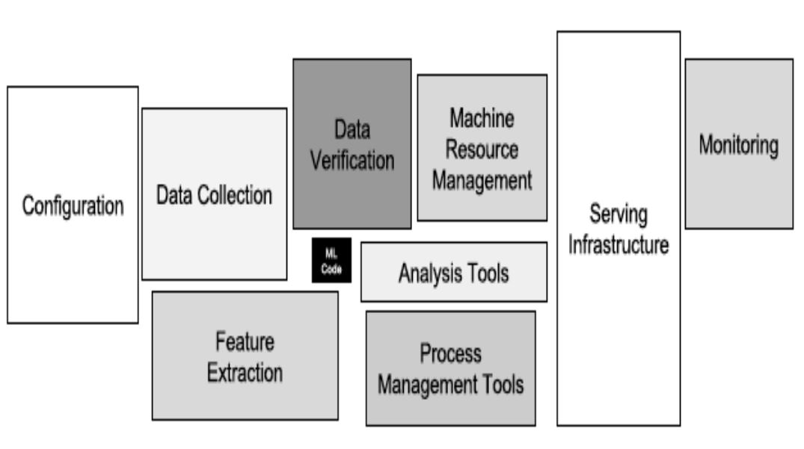
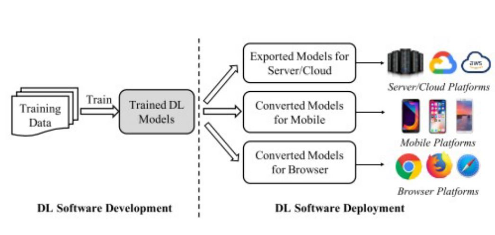

# Tutorial 6 - Engineering your Solution

This tutorial will go over how approach the challenge using a data science workflow. So lets get to understanding some overall ideas and then get into the tasks that will help you be successful in this challenge.

A data scientists job not only includes creating the model but more so handling data. 
<figure>

<figcaption align = "center"><b></b>
</figure>

Thankfully for this challenge, much of the tasks that a data scientist handles are taken care of by our team, such as the data cleaning and validation. But many aspects such as feature extraction, analysis, and creating the model are up to you. 

## Requirements Engineering

Requirements Engineering entails figuring out what you need to do to accomplish the task at hand. Specifically for this challenge, you need to create a model and output some data. Some questions to consider when doing your requirements are listed below.

 - What tools do I need to accomplish this task
 - How can I break this challenge into individual parts?
 - How is the data represented and what conclusions can I draw before I start modeling?
 - Are there methods in which I can analyze the data?

 This should hopefully be able to define the requirements needed to take on the task and be able to break down the challenge into what you need. 

## Design Flow

Design Flow talks about how you want the solution you are building to work. This can generally be a rough idea because things often change in the development of your solution. But being able to create some chart or diagram of the solution you are going to propose will help you guide your thought process about what you have to tackle next. Doing this should give you a methodology on how to attack the problem after you define the requirements. Below is a example of a higher level design flow for a Machine Learning application to give you an idea of how this may work.

<figure>

<figcaption align = "center"><b>Chen et al. 2020, A Comprehensive Study on Challenges in Deploying Deep Learning Based Software</b>
</figure>

## Feature Engineering

## Researching Models

## Developing a Model