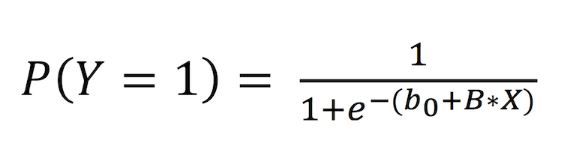

# Tutorial 7 - Building a Basic Regression Model

One of the most basic forms of modeling you can do is a regression. It can come in many forms (Linear, Ridge, etc). Understanding how regression works and how to implement it is one of the foundational things to understand when begenning your journey as a data scientist. In this tutorial, we will be going through the fundementals over Logistic Regression, as well as looking over some code examples that you can run on your JupyterHub on the Ironhacks Platform.

## Logistic Regression Theory

Logistic Regression is a method to modelling the probability of a certain event occuring. This means we have to understand the relationship beteween our independent variables (X1,X2,...) and our target variable (Y), which usually have a some binary value. Logistic regression is extremely helpful in problems where classification is involved. Below is the formal equation for logistic regression.

<figure>

<figcaption align = "center"><b></b>
</figure>

So what do the letters and numbers mean? ```P(Y=1)``` represents the probability of Y being 1. ```b_0``` is a parameter that is not linked to X and ```B``` is a coefficent vector that represents the relationship Y and our independent variables. Logistic Regression seeks to find the best possible values for the B vector to get the best possible fit, usually using [maximum log liklihood](https://towardsdatascience.com/probability-concepts-explained-maximum-likelihood-estimation-c7b4342fdbb1). 