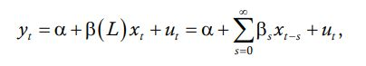

# Tutorial 7 - Building a Basic Regression Model

> Want to jump right into the code? [Click here for the notebook!](https://raw.githubusercontent.com/ironhacks/Tutorials-COVID-19/harshpavuluri/tutorial-7-dev/tutorials-Spring-2022/python/tutorial-7-regression.ipynb)

One of the most basic forms of modeling you can do is a regression. It can come in many forms (Linear, Ridge, etc). Understanding how regression works and how to implement it is one of the foundational things to understand when begenning your journey as a data scientist. In this tutorial, we will be going through the fundementals over Logistic Regression, as well as looking over some code examples that you can run on your JupyterHub on the Ironhacks Platform.

## Outline

End of this tutorial, you should know the following:
 - Understand a lag regression model (Theory, properties, etc)
 - Be able to implement lag regression in python
 - Include preprocessing??
 - Be able to implement a simple solution for the hack (Using other related/similar data)

## Sections
 * [Theory](#theory)
    * [Formulas](#formulas)
    * [When is it useful?](#when-is-it-useful)
    * [Implementation on Time-Series](#implementation-on-time-series)
    * [Underlying estimator and optimization](#underlying-estimator-and-optimization) 
 * [Implementation](#implementation)
 * [Summary](#summary)


## Theory

In this section, we will go through the implmentation on lag regression models, so that you can understand and be able to implement a simple model immediatly. 

A Distributed Lag Model is a model that lags a variable to get a better fitted data.

### Formulas

<figure>

<figcaption align = "center">
</figure>

```u``` here is a stationary error term to make adjustments to the model. ```a``` represents the initial values. ```B``` represents the lag weights for the independent variable, ```x```. This is the essential part of the the lag regression. Both ```B``` and ```x``` create the lag distrubution when combined together. 

### When is it useful?

Typically, lag regression tends to be most useful with data that involves some form of **time-series**. You will usually find this model implemented in applications that involve economics since it is able to do a great job of modeling ecomonic trends over a time. But it can applied to generally any subject area that involves time-series data. Though accuracy will completly depend on the data set you are working with. 

### Implementation on Time-Series

### Underlying estimator and optimization

## Implementation

> Check out the Jupyter Notebook here! [Logistic Regression](https://raw.githubusercontent.com/ironhacks/Tutorials-COVID-19/harshpavuluri/tutorial-7-dev/tutorials-Spring-2022/python/tutorial-7-regression.ipynb)

## Summary

Now that you have seen the theory and implementation of a lag regression, you should be able to have a head start into the hack and be able to come up with a simple model to predict the target variable. We can't give you all the answers, but hopefully this will give you a great starting point to begin modeling and producing some predictions. 


