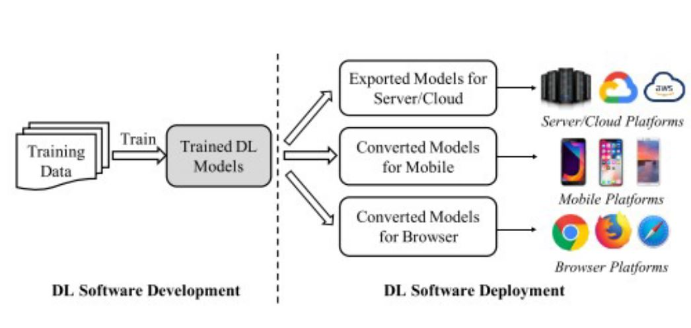

# Tutorial 4 - Engineering your Solution

This tutorial will go over how approach the challenge using a data science workflow. So lets get to understanding some overall ideas and then get into the tasks that will help you be successful in this challenge.

A data scientists job not only includes creating the model but more so handling data. 
<figure>

<figcaption align = "center"><b></b>
</figure>

Thankfully for this challenge, much of the tasks that a data scientist handles are taken care of by our team, such as the data cleaning and validation. But many aspects such as feature extraction, analysis, and creating the model are up to you. 

## Requirements Engineering

Requirements Engineering entails figuring out what you need to do to accomplish the task at hand. Specifically for this challenge, you need to create a model and output some data. Some questions to consider when doing your requirements are listed below.

 - What tools do I need to accomplish this task
 - How can I break this challenge into individual parts?
 - How is the data represented and what conclusions can I draw before I start modeling?
 - Are there methods in which I can analyze the data?

 This should hopefully be able to define the requirements needed to take on the task and be able to break down the challenge into what you need. 

## Design Flow

Design Flow talks about how you want the solution you are building to work. This can generally be a rough idea because things often change in the development of your solution. But being able to create some chart or diagram of the solution you are going to propose will help you guide your thought process about what you have to tackle next. Doing this should give you a methodology on how to attack the problem after you define the requirements. Below is a example of a higher level design flow for a Machine Learning application to give you an idea of how this may work.

<figure>

<figcaption align = "center"><b>Chen et al. 2020, A Comprehensive Study on Challenges in Deploying Deep Learning Based Software</b>
</figure>

## Feature Engineering

Now that we have an idea for how we want to create our solution, we can start building it. But first we need to know the features that we are working with. In Ironhacks, you will get fairly structured data so this should be easy to see what features you are working with. But for a deeper analysis, we want to see how each feature contributes to the variable we are predicting, or the target variable. 

So what we want to do is called Feature Engineering. Feature engineering helps us analyze and visualize how the data is working. To explore some methods of Feature Engineering, check out the links before

 - [Fundementals: Towards Data Science](https://towardsdatascience.com/feature-engineering-for-machine-learning-3a5e293a5114)
 - [How to get Good at Feature Engineering](https://machinelearningmastery.com/discover-feature-engineering-how-to-engineer-features-and-how-to-get-good-at-it/)
 - [8 Techniques in Feature Engineering](https://www.projectpro.io/article/8-feature-engineering-techniques-for-machine-learning/423)
 
 This should give a good baseline in how to visualize your data and be able to present it in a meaningful ways to others. Doing this will help you figure out what features you want to use in your data, how to manipulate them, etc. 

## Researching Models

Now that we have completed our feature engineering, we can now dive into finding a model that fits our data. Since different models accomplish different things, we want to make sure to employ the best model to get the best results. If the dataset is fairly linear, that seems like a good indication that we can create a linear regression model. If the data has more twists and turn, that might be a good indication that we may need something else to predict future outcomes. 

With good feature engineering, we can notice these trends and figure out what type of models may work with some good research. To help you get started, we included some ideas below on where to start. 

 - Insert Datamine links

## Developing a Model

This is where we now develop the model and create our end solution. But this isn't the end of story. We want to optimize our model as much as possible to get the best possible model. Some questions to consider are below.

- Can I remove or add more features to create a better model?
- Are there hyperparameters I could fine tune to create the best model?
- Are there trends in the data that I may be missing?
- Should I try to create a different model to try and get a better result?

When building a model, we not only want to try and find the solution, but we want to find the absolute best solution. This task may be daunting, but thats what makes data science so interesting. How can we make this better? Thats the question we have to ask ourselves when creating solutions. 