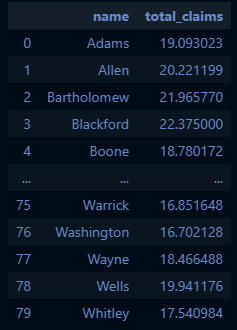
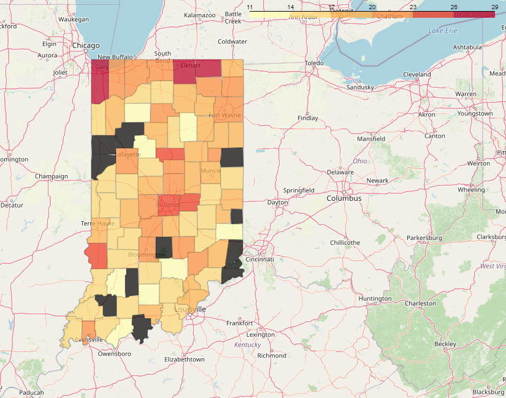

## Maps with Python using GeoPandas and Folium

Ideally, we would like to have json, geojson or shapefiles handy so we can plot the dimensions or coordinates of each county or tract.

Once this data is read into a dataframe using the ```gpd.read_file()``` command, our next step would be to either merge or correctly assign the right geometries to the right counties or tracts, like so:
```
import folium
import geopandas as gpd

countyMaps = gpd.read_file('<path>\\us-county-boundaries.geojson')

# copy to keep geometries intact
countyMapsFull = countyMaps.copy()
# merging on countyfips column
countyMaps['countyfips'] = countyMaps['statefp'] + countyMaps['countyfp']


countyMaps.drop(['statefp', 'countyfp', 'geoid'],axis=1, inplace=True)
countyMaps.drop(['countyns', 'namelsad', 'stusab', 'lsad', 'classfp', 'mtfcc',
                 'csafp', 'cbsafp', 'metdivfp', 'funcstat', 'aland', 'aland',
                 'awater', 'state_name', 'countyfp_nozero'], axis = 1, inplace=True)

countyMaps['countyfips'] = countyMaps['countyfips'].astype(np.int64)
countyMaps.drop(['geometry'], axis=1, inplace=True)
merged_df = pd.merge(<your_dataframe>, countyMaps, on='countyfips', how='inner')
```

The code above is simply preprocessing the files you need to get them to a point where it is possbile to visualize data with Folium quickly.

Once you run the code cell above, you should have one huge dataframe which contains two columns for tract names. We'll need to drop one.

```
merged_df.drop(['tract_name'], axis=1, inplace=True)
```

Now, say you would like to visualize the average number of claims per county up to week 37. We would get the mean using a groupby function to create a new, smaller dataframe that has the data we need.

```
avg_unemp_claims = merged_df.groupby('name', as_index=False)['total_claims'].mean()
```

The code above will do an SQL-like GROUP BY on county name, while aggregating the total claims column.
The resulting dataframe should look like this:



To map this, we will be using the Folium package; specifically, the ```folium.Choropleth``` function.

The Choropleth function needs two primary inputs, one to the data, in a series, list, array or dataframe object, and another to a geojson file, or any file that contains coordinate information. If you plan on plotting by a specific feature, a third input is necessary - ```key_on```.

```
area = folium.Map(location = [40.388619,-86.894097], default_zoom_start = .5)
folium.Choropleth(geo_data= countyMapsFull, data= avg_unemp_claims, name='choropleth',
                columns=['name', 'total_claims'], key_on='feature.properties.name',
                fill_color='YlOrRd', fill_opacity=0.7, line_opacity=0.2).add_to(area)
area
```

This should return an interactive map that looks like this:



This method can also be used for more granular maps, however, some mapping and data wrangling may be necessary on the tract level. Note that the ```key_on``` parameter requires a specific format to work, and should replicate the exact key for a feature represented in the geojson file.

Other mapping methods, like HeatMaps do not require this but functions such as overlays will need data to be in a geojson or json format to work correctly. 
